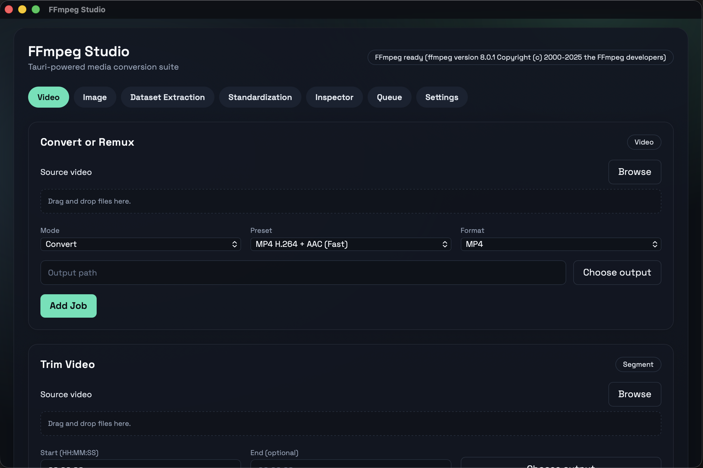
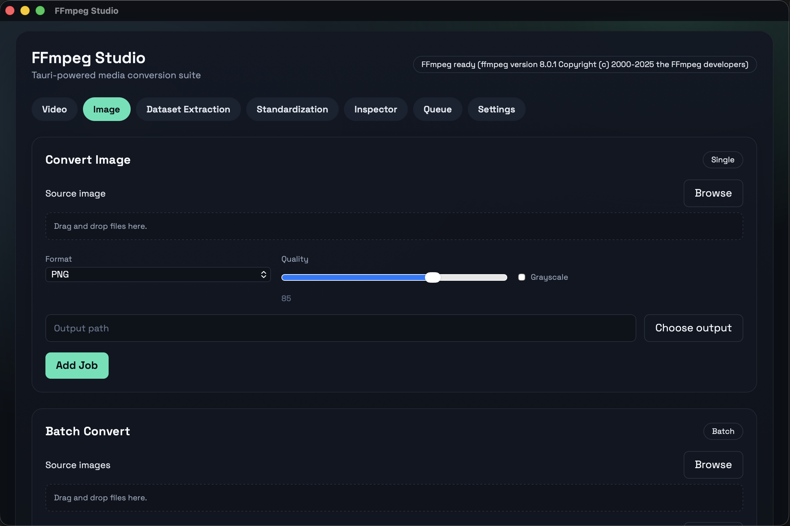
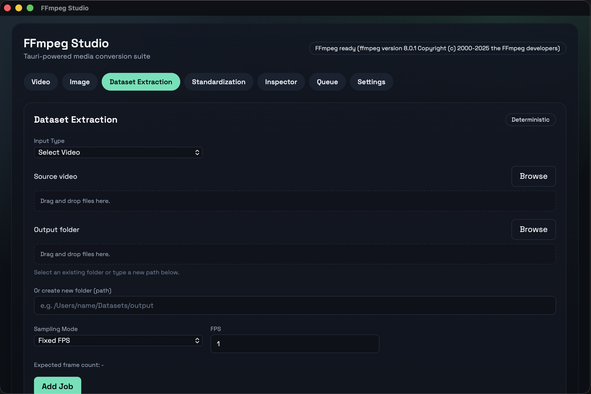
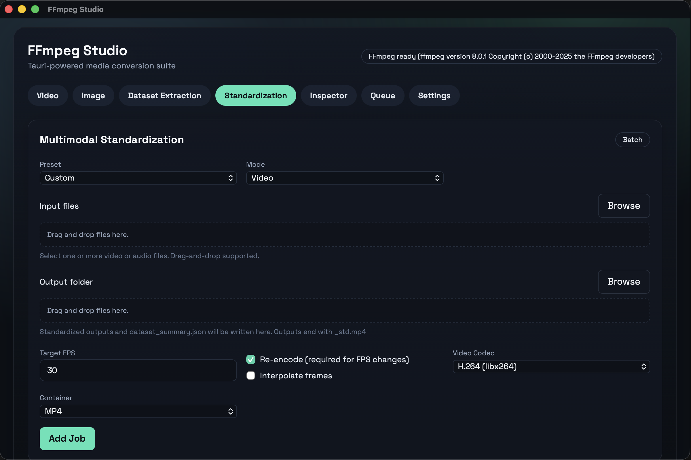
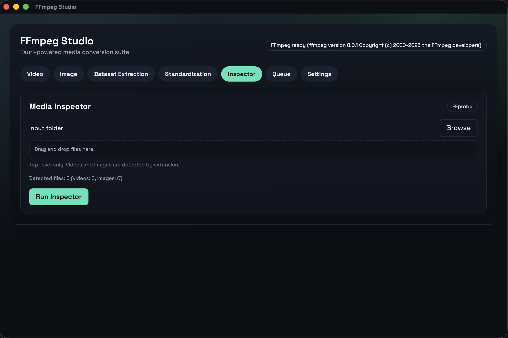

# FFmpeg Studio (Tauri + React)

FFmpeg Studio is a cross‑platform desktop app built with Tauri (Rust) and React that wraps FFmpeg into a clean, modern GUI. It’s designed for real production work: video conversion, image processing, dataset extraction, and media inspection — all with job queues, progress tracking, and deterministic outputs.

A production-ready desktop template that wraps FFmpeg with a modern GUI. Built with Tauri (Rust) and React (Vite) for cross-platform distribution.

## Screenshots







## Features

- Video: convert formats, remux, trim, extract audio, merge external audio
- GIF to video conversion
- Image sequences to video
- Image: convert formats, batch conversion, resize with aspect ratio preserved, quality control, grayscale
- Dataset Extraction: deterministic video-to-frames pipeline with per-video and global manifests
- Multimodal Standardization: batch-normalize video FPS or audio sampling rate with dataset summary output
- Media Inspector: ffprobe-based per-file metadata and dataset-level stats
- Job queue with per-task progress, cancellation, and logs
- Real-time FFmpeg progress via `-progress pipe:1`

## Prerequisites

## System Requirements

- Node.js 20+ (LTS recommended)
- Rust toolchain (stable, via `rustup`)
- System FFmpeg available on PATH (`ffmpeg` and `ffprobe`)
- OS: macOS, Windows, or Linux (desktop)

## Install Node.js (npm)

### macOS

```bash
brew install node
node -v
npm -v
```

### Windows (PowerShell)

```powershell
winget install OpenJS.NodeJS.LTS
node -v
npm -v
```

### Linux (nvm)

```bash
curl -o- https://raw.githubusercontent.com/nvm-sh/nvm/v0.39.7/install.sh | bash
export NVM_DIR="$HOME/.nvm"
source "$NVM_DIR/nvm.sh"
nvm install 20
nvm use 20
node -v
npm -v
```

## Setup

```bash
npm install
```

## Dev Mode

```bash
npx tauri dev
```

This launches the Vite dev server and the Tauri shell with live reload.

## Run From Terminal

### macOS (Terminal)

```bash
cd /path/to/MediaConverter
npm install
npx tauri dev
```

### Windows (PowerShell)

```powershell
cd C:\path\to\MediaConverter
npm install
npx tauri dev
```

### Linux (Terminal)

```bash
cd /path/to/MediaConverter
npm install
npx tauri dev
```

Build native installers:

```bash
npx tauri build
```

## Project Structure

```
MediaConverter/
├─ src/                     # React frontend
│  ├─ main.tsx
│  ├─ App.tsx
│  ├─ components/
│  │  ├─ VideoTools.tsx
│  │  ├─ ImageTools.tsx
│  │  ├─ DatasetTools.tsx
│  │  ├─ StandardizeTools.tsx
│  │  ├─ InspectorTools.tsx
│  │  ├─ JobQueue.tsx
│  │  └─ FilePicker.tsx
│  ├─ api/
│  │  └─ ffmpeg.ts
│  └─ styles/
│     └─ index.css
├─ src-tauri/               # Tauri Rust backend
│  ├─ src/
│  │  ├─ main.rs
│  │  ├─ ffmpeg.rs
│  │  └─ progress.rs
│  ├─ tauri.conf.json
│  └─ Cargo.toml
├─ presets.json
├─ package.json
└─ README.md
```

## FFmpeg Command Examples

Video convert (Fast MP4):

```
ffmpeg -i input.mkv -c:v libx264 -preset ultrafast -crf 28 -c:a aac -b:a 128k output.mp4
```

Audio extraction (MP3):

```
ffmpeg -i input.mp4 -vn -c:a libmp3lame -q:a 2 audio.mp3
```

Merge external audio with video:

```
ffmpeg -i input.mp4 -i audio.wav -c:v copy -c:a aac -b:a 192k -shortest merged.mp4
```

GIF to MP4:

```
ffmpeg -i animation.gif -c:v libx264 -preset medium -crf 20 -pix_fmt yuv420p animation.mp4
```

Image sequence to video (30 fps):

```
ffmpeg -f concat -safe 0 -i images.txt -r 30 -c:v libx264 -preset medium -crf 20 sequence.mp4
```

Dataset extraction (FPS sampling):

```
ffmpeg -i input.mp4 -vf "fps=5,showinfo" -vsync 0 -c:v png frame_%06d.png
```

Standardize video (30 fps H.264):

```
ffmpeg -i input.mov -r 30 -c:v libx264 -pix_fmt yuv420p -c:a copy input_std.mp4
```

Standardize audio (16kHz mono WAV):

```
ffmpeg -i input.mp4 -vn -ar 16000 -ac 1 -c:a pcm_s16le input_std.wav
```

Image conversion (JPEG -> WebP):

```
ffmpeg -i image.jpg -quality 85 image.webp
```

## Dataset Extraction

- Select a folder of videos (top-level only) or a single file
- Frames are saved in `output/<video_id>/` with names like `videoID_000001.png`
- Each video gets `manifest.csv`, plus a `global_manifest.csv` at the root
- Failures are appended to `errors.log` and processing continues

## Multimodal Standardization

- Batch normalization for video FPS or audio sample rate/channel layout
- Presets for Speech ML (16kHz mono) and Video ML (30fps H.264)
- Outputs include `dataset_summary.json` with per-file metadata and checksums

## Presets

Edit `presets.json` to add or tune conversion presets. Each preset is mapped directly into FFmpeg arguments.

## Troubleshooting

- **FFmpeg missing**: Ensure `ffmpeg` and `ffprobe` are available in your PATH.
- **No progress**: Some formats do not report duration. Progress will show indeterminate behavior until FFmpeg ends.
- **Permission errors**: Verify the output path is writable.

## Packaging Notes

This template does **not** statically link FFmpeg. Your target system must have FFmpeg installed.

To customize icons for installers, add icons and update `src-tauri/tauri.conf.json` `bundle.icon`.

## Release Disclaimer

macOS and Windows release binaries are built **without code-signing or notarization** by default. Some systems may block or warn when launching these installers. You can still run the app locally in dev mode from the terminal using `npx tauri dev`.

## Security Notes

- Tauri allowlist is limited to `dialog` APIs in `src-tauri/tauri.conf.json`.
- FFmpeg is launched directly by the Rust backend; only validated user inputs should be passed.
- If you extend file system access (e.g., Tauri FS API), update the allowlist accordingly.

## Extension Points

- GPU acceleration (NVENC, VideoToolbox, QSV): add flags in `presets.json` or new UI presets.
- Multi-pass or advanced filters: add new job builders in `src/components/VideoTools.tsx` and `src/components/ImageTools.tsx`.
- Dataset sampling modes: extend `run_dataset_extraction` in `src-tauri/src/ffmpeg.rs`.
